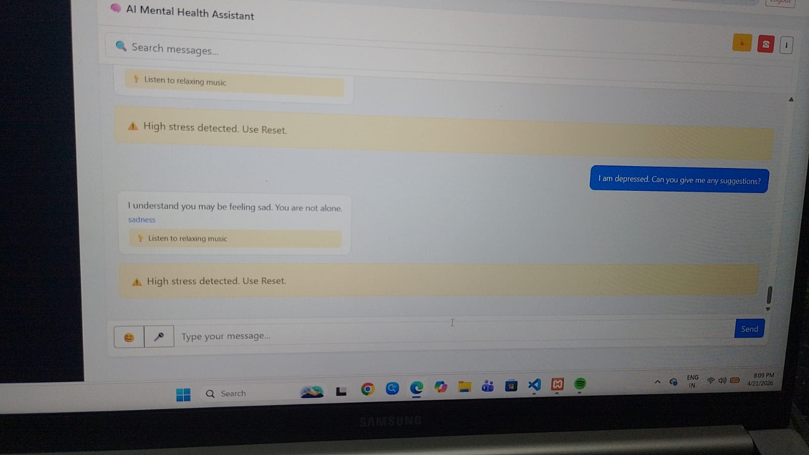
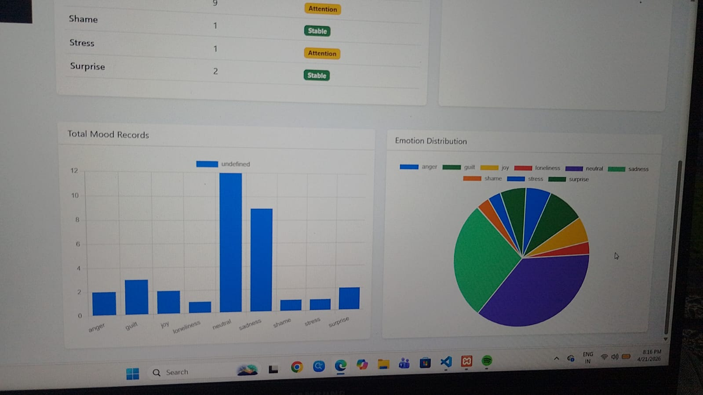
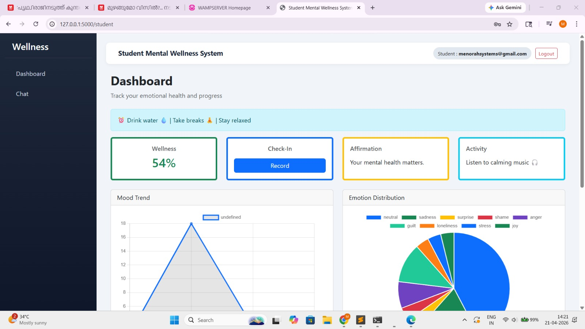

# mental-health-app
# 🧠 AI Mental Health Assistant Web App

## 📌 Description
This project is a full stack web application that helps users manage mental health through AI-based chat, mood tracking, and crisis alert detection.

## 🚀 Features
- AI Chatbot support
- Mood tracking system
- Crisis alert detection
- User-friendly interface

## 🛠️ Technologies Used
- HTML, CSS, JavaScript
- Python (Flask)
- MySQL

## ▶️ How to Run
1. Clone the repository
2. Install dependencies
3. Run the Flask app
4. Open in browser

## 📷 Screenshots
.jpeg)

## 👩‍💻 Author
Arfaah Meera
